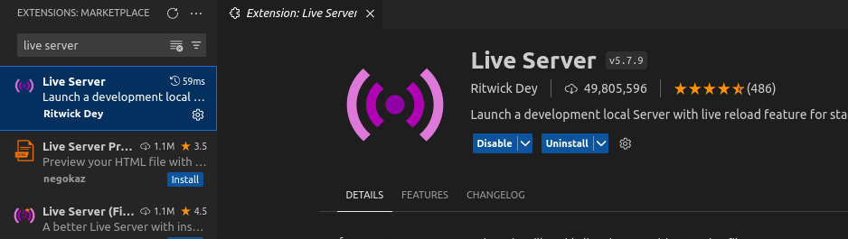
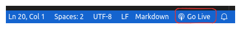
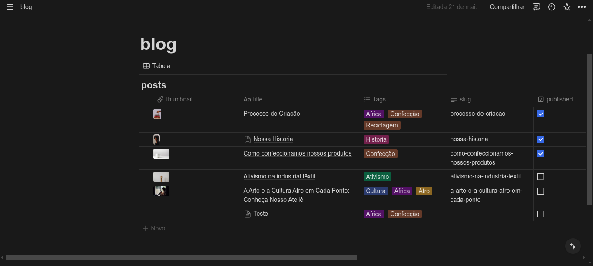

# Buguela Ateliê
Repositório destinado ao projeto multidisciplinar do primeiro semestre curso de Desenvolvimento de Software

## 👨‍💻 Executando
### Para instalar em sua máquina execute:
```
$ git clone https://github.com/AlvaroSena/atelie-buguela.git
``` 
### Entre no diretório
```
$ cd atelie-buguela
``` 

### Instale a extensão live-server no VsCode


### Rode a aplicação com live-server
Com o VsCode aberto, no canto inferior direito clique em "open with server".
Isso fará com que aplicação se inicie.


## 🚀 Funcionalidades

### Página inicial e suas seções

<strong>Primeira seção</strong>: 
Texto introdutório

<strong>Segunda seção</strong>: 
Catálogo de produtos em destaque. Os produtos estão em forma de "cards" que estão arranjados em um layout de grid com quatro colunas em telas grandes (desktop),
duas colunas em telas médias (tablets) e, por fim, uma coluna em 
telas pequenas (smartphones).

<strong>Terceira seção</strong>: 
Explicação sobre a empresa e história da Ana Buguela.

<strong>Quarta seção</strong>: 
Seção para contato com email, assunto e mensagem utilizando 
a biblioteca "Static Forms" para o envio dos dados.

<strong>Qunta seção</strong>: 
Rodapé com "links" de contato e rede sociais.

### Página do Blog

Desenvolvemos a página do Blog com "cards" contendo imagem, data e título.
Esses "cards" seguem o mesmo padrão dos "cards" de produtos, obervando telas grandes, médias e pequenas.
Fazer um "layout" responsivo foi indispensável, pois, além de ser um requisito não-funcional, é uma
necessidade para os clientes da Ana.

#### Dinamicidade
Entendemos que para satisfazer o desejo da Ana de ter um blog, não bastava publicações estáticas,
então decidimos integrar com a <strong>API (Application Programming Interface)</strong> do Notion - uma aplicação web para gerenciar arquivos de texto - e com ela bastaria puxar as publicações.


